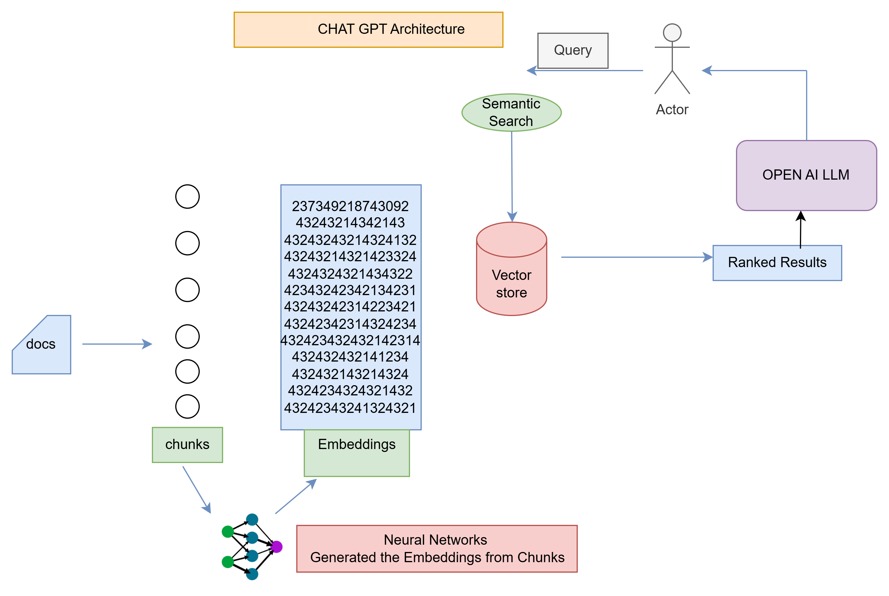

**Amazon Sage Maker**
----------------------
Amazon SageMaker is a cloud-based machine learning (ML) platform that helps users build, train, and 
deploy ML models. It's offered by Amazon Web Services (AWS)

**what is LLMs**
----------------
LLMs are large learning models specialised to understand NL(natural language).

why large because they work on huge parameters and has huge data set.

Large Models are better accurate as it has more data to predict more accuracy 
but more expensive to operate. they are also capable of handling more complex tasks.

Tokens - Text broken in chunks or tokens are tokens
        These are small chunks which model can understand
        playing can be broken in 2 tokens play+ing
        hello,how are you cna be broken in tokens 'hello' ',' 'how' 'are' 'and' 'you'
        The entire text is broken in to tokens and characters
        Token limits varies according to LLMs 
        GPT-4 Turbo has limit of 1,28,000 tokens

**Few Important Use cases for AI**
----------------------------------

Content Creation and Cpy writing
document analyser
Health Care and Medical Analysis
customer support chatBOts
Education and Elearning
Code Generation and Software Development
Sentiment analysis and market research

**Limitations of LLMs**
-----------------------
High Computational Costs and training to LLMs are highly expensive and requires a lot of costs.
Chat GPT are trained in public data not the private data.

**ChatGPT Architecture**
-------------------------

Semantic Search - Does the closest match between query and embeddings
                  Embeddings and chunks are stored in Vector Store.

Vectore Store- This is created by Lang Chain Community

Embeddings are the numerical representations of texts generated using OPEN-API Key.
Machine do not understand the texts and therefore numbers are generated for LLMs to understand.

Neural Networks Generates these embeddings from text to numbers.

**Fine tuning**
--------------------

                    

