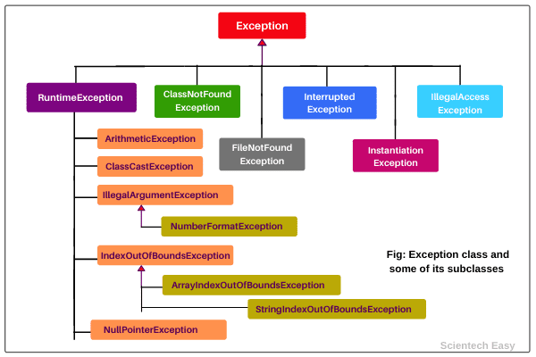
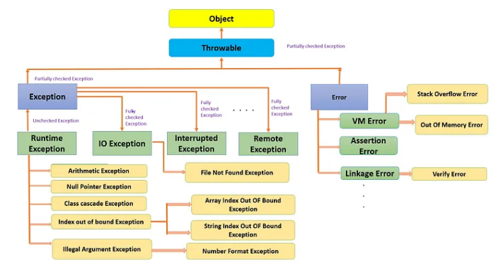

**How JVM Works (Execution Flow)**
----------------------------------

Compilation: Java code (.java) is compiled to bytecode (.class file) by the Java Compiler.

Class Loading: The Class Loader(System class loader) loads the .class file into the Method Area.

Memory Allocation: Objects and variables are created in the Heap and Stack.

Execution: The Execution Engine interprets or compiles the bytecode.

Garbage Collection: JVM cleans up unreferenced objects from the Heap.

**java access modifiers**
--------------------------

public -accessible everywhere

protected - same package and in its subclass(if outside package)

private - accessible in the same class

default - accessible in same package but not other package

**OOPS Concept in java**
-------------------------

Inheritence
Polymorphism
Abstraction
Encapsulation

                ENCAPSULATION

Wrapping data (variables) and methods into a single unit (class) and restricting direct access
to data.
e.g, use private to hide data from outside and use getter only to give access.

                Abstraction

Achieved using abstract classes and interfaces.Focus on what an object does rather than how it
does.

                Inheritence
Reusability of methods, variable from parent class.Implements and extends.
We cannot achieve multiple inheritence in classes , only with interface can be achieved.

                            Polymorphism
    Compile time Polymorphism             Runtime polymorphism

Compile time Polymorphism(Static)- Method Overloading - Based on the Reference

Run time Polymorphism(Dynamic) - Method Overriding - Based on the Object

**Access Modifiers in below**
-----------------------------

                    Class                       Variable                                   Method
Public              Yes                             Yes                                        Yes

Private             No                              Yes                                        Yes

Protected           No                              Yes but Only Instance Variable             Yes

Static        only static inner class               yes only instance variable                  Yes

Final              Yes                              yes                                        yes

Final and static are the keywords in java
Local variable cannot be static as it will give compile time error.
=========================================================================================
**Java Utilizes this memory as -**

    * When we write a java program then all the variables, methods, etc are stored in the stack memory.
    * And when we create any object in the java program then that object was created in the heap memory. 
    * And it was referenced from the stack memory.

**Can the main method be Overloaded?**

    Yes, It is possible to overload the main method. We can create as many overloaded main methods we want. However, 
    JVM has a predefined calling method that JVM will only call the main method with the definition of -

**Is it possible that the ‘finally’ block will not be executed?**

    Yes. It is possible that the ‘finally’ block will not be executed. The cases are- 
    Suppose we use System.exit() in the above statement.
    If there are fatal errors like Stack overflow, Memory access error, etc.

**What is a ClassLoader?**

    Java Classloader is the program that belongs to JRE (Java Runtime Environment).
    it loads the class in to memory during run time dynamically. Dynamically loading class gives 
    benefits in terms of memory usage and reducing startups e.g.
    Example: Loading a JDBC driver dynamically instead of hardcoding it.

    Types of classloader 
        extension
        bootstrap
        system - Class.forName

we should not use the classloader always as this is slower process and it shud be used when 
specific need.

**Can an ArrayList be made Thread-safe?**

    List<String> list = Collections.synchronizedList(new ArrayList<>());
    Wraps the list with synchronized methods.

    But iteration still needs external synchronization:
       
    synchronized (list) {
        for (String item : list) {
        // Safe iteration
        }
    }

**What part of memory - Stack or Heap - is cleaned in garbage collection process?**

    Heap

**What are shallow copy and deep copy in java?**

    Let's understand shallow copy with below example

    // Employee class

    public class Employee implements Cloneable {
    
        private int empoyeeId;
        private String employeeName;
        private Department department;
    
        public Employee(int id, String name, Department dept)
        {
            this.empoyeeId = id;
            this.employeeName = name;
            this.department = dept;
        }
        @Override
        protected Object clone() throws CloneNotSupportedException {
            return super.clone();
        }
    
        //Getters and Setters
    }

    // Department Class

    public class Department
    {
    private int id;
    private String name;
    
        public Department(int id, String name)
        {
            this.id = id;
            this.name = name;
        }
    
        //Getters and Setters
    }

    // Test class
    public class TestCloning {

	public static void main(String[] args) throws CloneNotSupportedException {

		Department hr = new Department(1, "Human Resource");

		Employee original = new Employee(1, "Admin", hr);
		Employee cloned = (Employee) original.clone();

		//Let change the department name in cloned object and we will verify in original object
		cloned.getDepartment().setName("Finance");

		System.out.println(original.getDepartment().getName());
		System.out.println(cloned.getDepartment().getName());
	}
}

Output - both will print
Finance
Finance

This is shallow cloning as default implementation will change the value in nested object value.

            ******Deep Cloning******

we would require to provide clone implementation inside Department class also and change clone
implementation in Employee class so for a deep copy, we need to ensure all the member classes
also implement the Cloneable interface and override the clone() method of the object class.

    Clone Implementation in Employee

        @Override
        protected Object clone() throws CloneNotSupportedException {
        Employee cloned = (Employee)super.clone();
        cloned.setDepartment((Department)cloned.getDepartment().clone());
        return cloned;
        }

    Clone Implementation in Department
        @Override
        protected Object clone() throws CloneNotSupportedException {
        return super.clone();
        }

    //Testing class

    public class TestCloning
    {
    public static void main(String[] args) throws CloneNotSupportedException
    {
    Department hr = new Department(1, "Human Resource");
    
            Employee original = new Employee(1, "Admin", hr);
            Employee cloned = (Employee) original.clone();
    
            //Let change the department name in cloned object and we will verify in original object
            cloned.getDepartment().setName("Finance");
    
            System.out.println(original.getDepartment().getName());
            System.out.println(cloned.getDepartment().getName());
        }
    }

output

Human Resource
Finance

**Use cases for Java Cloning**

    when creating objects are too much expensive or costly, 
    game server application where creating object is too much heavy and costly.

**Arrays**

    Java arrays are passed by reference always means any change will reflect in the values also.
**Instance, Local Variables**

    Instance variable can be defined in class where as Local can be defined in method , 
    blocks or constructors Instance or class(static) varaibles need not to define, 
    they take default values.
    Local variable need to be defined , they wont take default values.
    All final variable need to be initialized.

**static,Non static**

    we cannot call non static method/variable from static context
    we can call static method from non static method/context

**What is the use of constructors in java**

    Initialize the variable or any object.

**What is transient keyword or variable in java**

    The transient keyword in Java is used to indicate that a particular field of a class should 
    not be serialized.These variables are always ignored.
    
    E.G.
    transient int k=20;
    after seriralization
    k becomes=0, value ignored

    You can use password as transient because its sensitive data 

**Can we serialize static variables in java**

    Static Variable are not serialized in java hence the same value is gets printed after desrialization.
    Because they belong to class not the instance and in serialization process objects state is 
    maintained in network transfer

**what happen if we don't serialize in java**

    In serialization process objects are converted in to Bytestream which need to be written in a file.
    if we dont serialize then at the other end it will show java.io.NotSerializableException error
    if we are using caching then it also serializes before it is saved to cache.

**what is the use of serialversion id in serialization process**

    If a class has changed after serialization (e.g., fields are added/removed), the serialVersionUID 
    ensures that deserialization is only successful if the class version matches.

**Can transient static data can be serialized?**

    No making static data as transient will not make any difference

**what is volatile keyword in java**

    The volatile keyword in Java is used to mark a Java variable as 
    “being stored in the main memory.”

    Every thread that accesses a volatile variable will read it from the main memory 
    and not from the CPU cache.
**Given a large collection of Employee objects, write the most efficient stream operations to find employees whose salary is above a threshold.**
-------------------------------------------------------------------------------------------------------------------------------------------------

    list.parallelStream - enables to work parallel for high list of data.
    It divides the workload into multiple threads, utilizing multi-core processors efficiently.

**Java is passed by reference or pass by value?**
-------------------------------------------------

    Primitive data types are passed by Value.
    
    Object are passed as copy as reference
    
    Strings are immutable hence passed by value.
    
    All objects are passed by reference and will change the value except String.

**which variable will you define as static or volatile in java**
-----------------------------------------------------------------

    Static variable are related to Class and its value is shared to all objects but if 2 threads
    are accessing the static variable then if value is changed by 1 thread then the updated value is not reflected
    in 2nd thread due to static.
    
    Volatile are stored in RAM and its value is shared by all thread of every object.
    so if any object is accessible by 2 threads and if any thread chnages the value then it will be
    reflcted in 2nd thread also whcih was not the case for static.

    Real use case of static -

    When creating a Singleton pattern.

    For utility/helper methods that do not depend on instance variables.

    Real use case of volatile

    When multiple threads read and write a shared variable.

**Why we need immutable class in java and what is the use of this?**
--------------------------------------------------------------------

    Immutable class object does not change the state and its state is reserved so no other thread can
    use and change the state else it will be inconsistent behaviour.
    
    Hashcode for Immutable class is constant and cannot be changed.
    Java’s String class is immutable to prevent security vulnerabilities like unauthorized
    modifications in URLs or database queries.
    
    Hash-based collections (HashMap, HashSet) rely on an object's hashCode. If an object’s state changes after being
    added to a collection, it can lead to inconsistent behavior.

**How to make the Immutable class in java?**
-------------------------------------------
    Declare the class final → Prevents subclassing.
    Make fields private and final → Prevents direct modification.
    Do not provide setters or methods that modify state.
    Use defensive copies for mutable fields.
    Return new objects instead of modifying existing ones.
    
    String, Integer, Double, BigDecimal, LocalDateTime are all final and Immutable class.

**what is diamond problem in OOPS**
------------------------------------
        Class A has a method foo().
        Class B and Class C both extend A and override foo().
        Class D extends both B and C.
        The problem arises when calling foo() from an object of Class D, because the JVM doesn't 
        know whether to call the method from B or C, since both have their own implementations of foo().

        To solve this, Java requires the implementing class to override the conflicting method and 
        resolve the ambiguity.

**what is memory leak in java and how it can be prevented?**
------------------------------------------------------------
    Memory leak can happen in case when objects are created and now no longer needed but still referenced
    by variable method or class , it exist still in memory and lead to memory leak.

**How to avoid memory leak in java**
------------------------------------

    1. close the connections immediate after use.
       2. Storing objects in caches without having a proper eviction strategy or timeout mechanism 
          can cause memory leaks, especially if the cache grows over time.
       3. consider using WeakReferences or SoftReferences.

**what is weakreference and how it can help Garbage Collection**
-----------------------------------------------------------------

    A WeakReference in Java is a reference that does not prevent its referent (the object it points to) 
    from being garbage collected. If an object is only weakly reachable (i.e., it is referenced only 
    by weak references), then it can be collected by the Garbage Collector (GC), even if there are no 
    other strong references to the object.

Class Variables or Static Variable within class
----------------------------------------------
Need not to initialize during declaration.They will take default values.
Since there are static variable which means specific to class and hence for all instances value will
be shared same

    Example

    Class A {
        static int g=10;
        A a = new A();
        a.g=20;/// now this will be the final value everywhere all instances because due to static
    }

Instance Variables - within class but non-static
------------------------------------------------
Need not initialize during declaration.They will take default values.
The values are specific to each instances.

Local Variable - within method, constructor or block
-----------------------------------------------------
local variable also need not to be initialized but when its used anywhere it will ask to initialize first , won't take default values.
declaring local variable int g; is fine but when we use it will give error if not initialized

**Final Variables**
-------------------
Final Variable has to be initialized else error everywhere.

Non static field cannot be accessed in static context, either you define it static or access by creating
an object of the class

Method Overloading
-------------------
* Methods can be overloaded and overrided
* Static Methods can be overloaded by same name but different signature
* We cannot overload static and non static methods together as compiler cannot identify
  which method to call.

**Method Overriding**
---------------------
Non static methods can be overrided  
static method also can be overrided
static method cannot be overrided by non static methods - compile time error
non static methods cannot be overrided by static methods - Compile time error

static methods are called depending on the class reference - method overloading
non-static methods are called depending on the class object - method overriding
static and non-static variables can be accessed in the child class also

**When is the object created with new keyword?**
-------------------------------------------------
runtime

**can we use this or super in the static method/context?**
------------------------------------------------------------
NO

**How many Objects are created below**
--------------------------------------
String a = new String(“Interviewbit”);
String b = new String(“Interviewbit”);
String c = “Interviewbit”;
String d = “Interviewbit”;

3

**Where does the system stores parameters and local variables whenever a method is invoked?**
---------------------------------------------------------------------------------------------
stack

**Static cannot be used for constructor. is this true?**
---------------------------------------------------------
Constructor can be private,protected or public but not static
Constructors cannot be final or static

**What is the implicit return type of constructor?**
-----------------------------------------------------
Implicit return type of constructor is the class object in which it is defined.

**When is the finalize() method called?**
-------------------------------------------
Before Garbage collection

**Can private method be overrided?**
--------------------------------------
Yes but private method defined in super class cannot be accessed in the subclass

**Consider below program**
--------------------------

    class Base {
        private void fun() {
            System.out.println("Base fun");     
        }
    }
    
    class Derived extends Base {
        private void fun() {
            System.out.println("Derived fun");     
        }
        public static void main(String[] args) {
            Base obj = new Derived();
            obj.fun(); //fun method is of type Base whose private method cannot be accessed outside
        }  
    }

private is specific to class hence class reference will be used to access the class method.So here Base class method will be called
but error due to private modifier in fun method in Base.

this will give compile time error as fun method cannot be accessed by subclass object

**can weaker access be given to overrided method in subclass?**
--------------------------------------------------------------
No never

**Can a private method in super class be overrided in child class by public method.**
-------------------------------------------------------------------------------------
yes but super class method will not be visible in child class due to its private.

**Difference between static and volatile**
-------------------------------------------
Static are more towards class level where any change will be reflected to every object/instance of that class.

Volatile is itself reflected for multithreading where all threads will share the latest value of variable
as the variable resides at main memory.

=====================================================

**Abstract Class**
-------------------

1. Abstract class cannot be instantiated. if Demo is abstract class then below will be compile time errro
   Demo demo = new Demo();

2. if you have created 2 abstract classes and you have created a class whcih extends both
   abstract class then that class need to implement both the abstract method.

================================================================

Class1 {
void show(){}
}

Class2 extends Class1 {
void show(){}
}

if you put methods as above or mark as static it will work.

=================================

**Constructor Calling Hierarchy**
---------------------------------
    Base1 {
        Base1(){
        }
        Base1(int b){
        }
    }

    Base2 extends Base1 {
        Base2(){
        }
        Base2(int b){
        }
    }

    Base3 extends Base2 {
        Base3(){
        }
    
        Base3(int h){
        }

        PSVM(){
        Base3 base3  =  new Base3(10);//it will call Base1 and Base2 default contructor and Base3 argument contructor
        }
    }

================================

**Data Types in Java and their ranges**
----------------------------------------
Primitive data types

    byte - -128 to 127 1 byte
    short - 2 byte
    int - 4 byte
    long - 8 byte
    float - 4 byte
    double - 8 byte
    char - 2 bytes, 0 to 65536
    boolean - 0 or 1 - 1 byte or 2 byte

Non primitive data types

String
Array
Interfaces
ENUM

==============

String has method length for size
Array has length

**Operators in java**
----------------------

| - This checks both the condition
||(short circuit operator) - This checks the second condition if first one is false.

& = This also checks both the condition
&& = This checks the second condition if first one is false.

**Difference between String , String buffer and String builder**
----------------------------------------------------------------
1. String is immutable whereas String buffer and string builder is mutable class.
2. String is not synchronized(no synchronized methods available) , String buffer is synchronized(all methods synchronized)
   , string builder is not synchronized.(no synchronized methods available)
3. String is thread safe , String buffer is thread safe but string builder is not thread safe.
4. Performance is significant good for string and string builder as both are not synchronized.

**Usages**
------------
String -This is used when we want immutability.
String Builder - This is used when Thread safety is not required.
String buffer -This is used when Thread safety is required.

**Problem with String**
-----------------------
Inefficient for frequent string manipulation, as it creates new objects with each modification,
leading to performance overhead.

**Problem with String Builder**
-----------------------
Not thread-safe. If used in a multi-threaded environment, additional synchronization is required
(use StringBuffer for thread safety).

**Problems with String Buffer**
-------------------------------
Slightly less efficient than StringBuilder due to thread safety overhead. It's generally recommended for
multi-threaded scenarios.

**String Operations**
---------------------
1. When any String Object is created using new Operator , it-
   Create an Object in Java Heap Memory
2. When any string Literal is created using String str=""; then the object is created in String Pool Area.
   if you do

   String str1 = new String("Prakash");
   String str2 = "Prakash";
   str1==str2----> return false as first line creates an object in Heap and second line in string pool
   which has different references and return false
3. if you create two string with new operator have same content then str1==str2 will return false as both
   are having different references

**String Intern Operations**
----------------------------
    "string".intern();

Intern create/add the string in String pool and return reference of it.

String string8 = new String("Vikas");
String string9 = "Vikas";
System.out.println("Equality Check via equals intern operator===="+(string8==string9));//prints false

String string8 = new String("Vikas").intern();
String string9 = "Vikas";
System.out.println("Equality Check via equals intern operator===="+(string8==string9));//prints true
as same string is returned from pool

**String several methods**
---------------------------

IndexOf - returns the index of char or substring first occurrence in string
-starts with 0 and count

    public class Main {
    public static void main(String[] args) {
    String myStr = "Hello";
    System.out.println(myStr.indexOf("o"));
    }
    }

Prints 4

==========================================

**Multithreading**
------------------

1. If you want any process to be completed first then another process to start then use join method.
   for e.g, if t1,t2 and t3 are the thread which are executing and you want t1 to finish before
   t2 then use below
   t1.start()
   t1.join() - join will ensure t1 gets finished before t2 starts.
   t2.start()
   t2.join() - once t2 finished then t2 will start
   t3.join()

    2. Multithreading can be achieved by 2 ways.Extending the class with Thread and implementing by runnable interface.
       Extending any thread can be preferred as the object can use multiple methods yield and interrupt
       which is not possible in case of runnable.
    3. Suppose you have 2 threads and you started both by using t1.start and t2.start and then you are using
       t1.join and then t2.join.This will not synchronize threads to run one after another because you started both together.
       To make it work one after another you need to use as below
       t1.start()
       t1.join()
       t2.start()
       t2.join()

Now this will make t1 to start and finish first and then same way for t2.

4. if you started both by t1.start and t2.start and t1.join and t2.join then to make it synchronize
   you will need to use either synchronized block or method.

**Life Cycle of MultiThreads**
-------------------------------

1. New thread
2. Runnable
3. Block
4. Wait
5. Terminate

**Thread scheduler**
---------------------

1. To schedule thread to run every 2 seconds till 10 seconds
   Use ScheduledExecutorService class and call scheduleAtFixedRate method to call Thread class where function
   is written refer program TestThread in this package.
   Refer [ScheduledExecutorService.java]() file

**Thread Pool**
---------------
1.  Create pool of threads and use it when needed else put that in pool to future use.
2.  Refer Program [ExecutorServiceExample.java]() for more reference
3. You can use ExecutorService and ThreadPoolExecutor class for the same

**CountDownLatch**
-------------------
1. Using a CountDownLatch we can cause a thread to block until other threads have completed a given task.
2. you need to create an instance of countdownlatch and use methods wait and countdown to decrement the sequence.
3. CountDownLatch is particularly useful in scenarios where you need to wait for a set of operations to
   complete before proceeding.

refer program CountDownLatchDemo.java

**difference between wait,notify and notify all and sleep**
-----------------------------------------------------------
wait, notify and notifyall are object class method where sleep is thread class method

**Thread Interruption**
-----------------------
Thread can be interrupted by using Thread.interrupt() method.
Once thread is started by start method the same can be interrupted anytime.
Interrupts and force thread to stopped

**Asynchronous programming**
--------------------------------------------------
Async call can be made in java using Completable Future class or ExecutorService as below
In this an Async call is added to queue and will be returned after its completed

Refer full program in [CompletableFutureProgram.java]()

    CompletableFuture<String> future = CompletableFuture.supplyAsync(() -> {
    try {
    Thread.sleep(200);
    } catch (InterruptedException e) {
    e.printStackTrace();
    }
    return "Hello, CompletableFuture!";
    });

or ExecutorServiceProgram.java

**ExecutorService**
-------------------

ExecutorService automatically provides a pool of threads and an API for assigning tasks to it.
It executes the tasks asynchronously.
It manages the thread creation and management.

**CompletableFuture**
---------------------
CompletableFuture is a class in java.util.concurrent that represents an asynchronous computation.
It allows writing non-blocking, parallel, and reactive-style code in Java.

**Problem Statement**
---------------------
    Implement a solution that processes (just log) a large dataset of payments using multithread 
    and grouping them based on payment type.

------------------------program----------------------

      import java.util.*;
      import java.util.concurrent.*;
      import java.util.stream.IntStream;
      
      class Payment {
      private final String paymentType;
      private final double amount;

    public Payment(String paymentType, double amount) {
        this.paymentType = paymentType;
        this.amount = amount;
    }

    public String getPaymentType() {
        return paymentType;
    }

    public double getAmount() {
        return amount;
    }

    @Override
    public String toString() {
        return "Payment{" + "type='" + paymentType + "', amount=" + amount + '}';
    }
}

      public class PaymentProcessor {
      private static final int THREAD_COUNT = 4;

    public static void main(String[] args) {
        // Generate a large dataset of payments
        List<Payment> payments = generatePayments(1000);

        // Process payments using multithreading
        processPayments(payments);
    }

    private static List<Payment> generatePayments(int count) {
        String[] paymentTypes = {"Credit Card", "Debit Card", "UPI", "Net Banking"};
        Random random = new Random();
        List<Payment> payments = new ArrayList<>();

        for (int i = 0; i < count; i++) {
            payments.add(new Payment(paymentTypes[random.nextInt(paymentTypes.length)], random.nextDouble() * 1000));
        }
        return payments;
    }

    private static void processPayments(List<Payment> payments) {
        ExecutorService executorService = Executors.newFixedThreadPool(THREAD_COUNT);
        ConcurrentMap<String, List<Payment>> groupedPayments = new ConcurrentHashMap<>();

        for (Payment payment : payments) {
            executorService.submit(() -> {
                groupedPayments.computeIfAbsent(payment.getPaymentType(), k -> Collections.synchronizedList(new ArrayList<>()))
                               .add(payment);
                System.out.println("Processed: " + payment);
            });
        }

        executorService.shutdown();
        try {
            executorService.awaitTermination(1, TimeUnit.MINUTES);
        } catch (InterruptedException e) {
            Thread.currentThread().interrupt();
        }

        // Log grouped payments
        System.out.println("\nPayments grouped by type:");
        groupedPayments.forEach((type, list) -> System.out.println(type + " -> " + list.size() + " transactions"));
    }
}
-------------------------------------------------------------------------------------------------------------------

**Thread Synchronization**
---------------------------
1. Used for synchronization of threads

Refer the program below

    class PrintDemo {
    public void printCount() {
    try {
    for(int i = 5; i > 0; i--) {
    System.out.println("Counter   ---   "  + i );
    }
    } catch (Exception e) {
    System.out.println("Thread  interrupted.");
    }
    }
    }

    class ThreadDemo extends Thread {
    private Thread t;
    private String threadName;
    PrintDemo  PD;
    
    ThreadDemo( String name,  PrintDemo pd) {
    threadName = name;
    PD = pd;
    }
    
    public void run() {
        synchronized(PD) {
        PD.printCount();
        }
    System.out.println("Thread " +  threadName + " exiting.");
    }
    
    public void start () {
    System.out.println("Starting " +  threadName );
    if (t == null) {
    t = new Thread (this, threadName);
    t.start ();
    }
    }
    }

    public class TestThread {
    
    public static void main(String args[]) {
    PrintDemo PD = new PrintDemo();

      ThreadDemo T1 = new ThreadDemo( "Thread - 1 ", PD );
      ThreadDemo T2 = new ThreadDemo( "Thread - 2 ", PD );

      T1.start();
      T2.start();

      // wait for threads to end
      try {
         T1.join();
         T2.join();
      } catch ( Exception e) {
         System.out.println("Interrupted");
      }
}
}

**Join Method**
---------------
join method tells that unless t1 thread completes dont start.
t1.start()---start t1
t1.join()----dont start unless t1 ends

**Synchronization can be achieved by 2 ways**
-----------------------------------------------
1. synchronized block(above program is using synchronized block)

This type gives you more flexibility to put only the code which need to be synchronized
rather than synchronizing entire method. It implements lock on class object.

2. synchronized method
   synchronizing entire method.

**Thread Intercommunication**
-----------------------------
Thread can communicate themself via wait(), notify() and notifyall() method.
refer [TestThread.java]() file for using wait , notify and notifyall method.

wait, notify and notifyAll exist in Object Class.

**difference between thread start and run method**
--------------------------------------------------
start method is unpredicatable which thread will be given chance to execute but when you call
run method direct its synchronous method.

**CountdownLatch in java 8**
----------------------------

CountDownLatch is used to make sure that a task waits for other threads before it starts.
To understand its application, let us consider a server where the main task can only start
when all the required services have started.

**Working of CountDownLatch:**
------------------------------
When we create an object of CountDownLatch, we specify the number of threads it should wait for,
all such thread are required to do count down by calling CountDownLatch.countDown() once they
are completed or ready to the job. As soon as count reaches zero, the waiting task starts running.

Example below:

      public class CountDownLatchDemo
      {
      public static void main(String args[])  
      throws InterruptedException
      {
      // Let us create task that is going to  
      // wait for four threads before it starts
      CountDownLatch latch = new CountDownLatch(4);

        // Let us create four worker  
        // threads and start them. 
        Worker first = new Worker(1000, latch,  
                                  "WORKER-1"); 
        Worker second = new Worker(2000, latch,  
                                  "WORKER-2"); 
        Worker third = new Worker(3000, latch,  
                                  "WORKER-3"); 
        Worker fourth = new Worker(4000, latch,  
                                  "WORKER-4"); 
        first.start(); 
        second.start(); 
        third.start(); 
        fourth.start(); 
  
        // The main task waits for four threads 
        latch.await(); 
  
        // Main thread has started 
        System.out.println(Thread.currentThread().getName() + 
                           " has finished"); 
       } 
      } 
         @Override
         public void run()
         {
         try
         {
         Thread.sleep(delay);
         latch.countDown();
         System.out.println(Thread.currentThread().getName()
         + " finished");
         }
         catch (InterruptedException e)
         {
         e.printStackTrace();
         }
         } 

==================================================================

**Difference between synchronized block and synchronized method?**
------------------------------------------------------------------
1. Both locks the current instance or object of the class but method locks the entire body
   but block locks the particular block only.

2. why method should be static not non static
   when we say static method means for class and when we say non static method means objects or
   instances of that class.
   so the method which we created should be static so that when synchronized it should lock the entire
   class does not matter how many instances are there but if we make that method as non static
   then if multiple threads can deal with multiple instances of the class so if one instances is
   locked other instance from another thread can modify that shared resources.

3. Synchronized will make sure thread are accessing the resources in synchronized way but which thread
   will access in which order that's not guarantee.

**Thread Interruption**
------------------------

thread interruption is needed when it is taking too much time for execution or getting response on
network call or DB call.

it interrupt the thread gracefully and then it will come in exception handling block whcih can
be handled gracefully.

Please consider sample program
ThreadInterruptExample.java

**MAE Multithreading**
----------------------

In MAE we are using multithreading when we make a DB call to execute something but when any exception occurs
we simply use as below-

Thread.currentThread().interrupt();

**CountDownLatch**
----------------------
In Countdownlatch main thread can wait for multiple worker threads to finish

Refer CountDownLatch.java program to understand how it works.

**How is it different with Join()?????**
----------------------------------------
Join works for one thread where CountDownLatch works for multiple threads.

Join==> One to one
CountDownLatch==> one to many.

**ExecutorService and Completable Future in java**
--------------------------------------------------

ExecutorService is used to create thread as many you want so all thread will run
asynchronously but to run those threads in parallel Completable Future is used

Refer the best and efficient program - ExecutorServiceProgram.java

**Thread Local**
----------------

Thread local is a class which sets any variable to thread wise not global.
Each thread will have their local copies of the variable value and other threads cannot access
that value or change the value.

==================================Memory Optimization============================

**Optimize Memory Usage**
-------------------------

* Use local variables and method parameters whenever possible, as they are allocated on the
  stack and have minimal impact on memory management.

* Minimize object creation, especially in loops or frequently executed code paths, to reduce garbage
  collection overhead.

* Use the String.intern() method to share instances of equal string literals, reducing memory footprint.

* Use StringBuilder for String Concatenation
  In Java, strings are immutable. When you concatenate strings using the ‘+’ operator, a new String
  object is created,
  which can impact performance. Instead, use StringBuilder to concatenate strings more efficiently

**BAD Example**
----------------

    String result = "";
    for (int i = 0; i < 1000; i++) {
    result += "example";
    }

**GOOD Example**
-----------------
    StringBuilder sb = new StringBuilder();
    for (int i = 0; i < 1000; i++) {
    sb.append("example");
    }
    String result = sb.toString();

**Take Advantage of Java Concurrency:**
---------------------------------------
Java offers robust support for concurrency, allowing you to execute tasks in parallel to improve the
performance of your applications. Use the java.util.concurrent package to implement thread-safe data
structures, thread pools, and other concurrency utilities.

**Use Lazy Initialization**
----------------------------
Lazy initialization is a technique in which an object is created only when it’s needed.
This can be useful in situations where creating an object is expensive, and it’s not always needed.
Be cautious when using lazy initialization in multi-threaded environments, as you may need to handle
synchronization issues.

example 1-

One good example is to not create a database connection up front, but only just before you need to get
data from the database.

example 2-

java.util.function.Supplier is a functional interface which is perfect example of Lazy Intializer
it's not called when u define but you call get function of it then it creates an object.

**Avoid Using BigDecimal Class**
---------------------------------
We know that BigDecimal class provides accurate precision for the decimal values.
Over usage of this object hampers the performance drastically specifically when the same is used
to calculate certain values in a loop. BigDecimal uses a lot of memory over long or double to
perform calculations. If precision is not the constraint or if we are sure the range of the calculated
value will not exceed long or double we can avoid using BigDecimal and use long or double with proper
casting instead.

**Use Stored Procedures Instead of Queries**
--------------------------------------------
It is better to write stored procedures instead of complex and long queries and call them while processing.
Stored procedures are stored as objects in the database and pre-compiled.
The execution time of the stored procedure is less compared to the query with the same business logic
as a query is compiled and executed every time wherever it is called through the application.
Also, the stored procedure has an advantage in data transfer and network traffic since we are not
transferring the complex query for execution every time to the database server.

**Use of Unnecessary Log Statements and Incorrect Log Levels**
---------------------------------------------------------------
The logging level should be kept to higher levels like DEBUG, ERROR, and not INFO.

**Avoid Selecting all columns**
--------------------------------

Select Required Columns in a Query not all columns.Sometimes selecting all columns may result in delay
if Huge DB records are there.

**Fetch the Data Using Joins**
------------------------------

============================================Java 8 Features=======================

                            **java 8 comes with below features**
                            ------------------------------------
The objective of java 8 comes with more or less on -
1. Provide more readability
2. Maintainability of code
3. Avoid any boilerplate code
4. Avoid using any big anonymous codes.

**Lambda Expressions: Concise functional code**
-----------------------------------------------

**Functional Interfaces: Single-method interfaces**
---------------------------------------------------

       Only one abstract method but multiple default and static methods.
       Example are Runnable,ActionListener, Comparator, Callable

       **Types of Functional Interface**

       Consumer - The Consumer functional interface in Java 8 is used to represent an operation that 
                    accepts a single input argument and returns no result. It is often used when you 
                    want to perform an action or side-effect on an object without needing to return a value.
                    it has only one method - void accept(T t);
                    Consumer<String> printMessage = message -> System.out.println(message);
                    // Use the Consumer
                    printMessage.accept("Hello, Consumer!");
       Predicate - Put multiple conditions in one predicate and use this predicate anywhere you want to use.

       Supplier - it usually takes no argument but generates a result
                    it is used for lazy initialization , when you needed then only you can get value.
                    it has get method.
                Example-
                    Supplier<Double> randomValueSupplier = () -> Math.random();
                    System.out.println(randomValueSupplier.get()); 

       **Benefits of Functional Interface**
       The major benefit of java 8 functional interfaces is that we can use lambda expressions 
       to instantiate them and avoid using bulky anonymous class implementation.

**Introduced and Improved APIs**
--------------------------------
Use and Introduction of new Stream APIs.

**Optional Class**
------------------

It helps to avoid NullPointerException by providing methods to handle the presence or absence of
values more gracefully.

Eliminates the need for explicit null checks.
Few Examples of Optional

1. Optional.ofNullable("user@example.com");
   optionalEmail.ifPresent(email -> System.out.println("User email: " + email));
   Checks if value present then do the action

2.  Optional<String> optionalEmail = Optional.ofNullable(getEmail());
    String email = optionalEmail.orElse("default@example.com");
    checks if the value is null then set any default value

3. Optional<String> optionalName = Optional.of("John Doe");

4. Optional<String> optionalEmail = Optional.ofNullable(null);
   // Throw an exception if email is missing
   String email = optionalEmail.orElseThrow(() -> new RuntimeException("Email not found"));

**forEach() enhanced for loop**
-------------------------------

**Method References**
----------------------
Method references reduce the amount of boilerplate code required, making the code shorter and easier
to maintain.

**ParallelStream for Big List of Data**
---------------------------------------

    By default, any stream operation in Java is processed sequentially, unless explicitly specified 
    as parallel.

    List<Integer> listOfNumbers = Arrays.asList(1, 2, 3, 4);
    listOfNumbers.stream().forEach(number ->
    System.out.println(number + " " + Thread.currentThread().getName())
    );

    The output of this sequential stream is predictable. The list elements will always be 
    printed in an ordered sequence.

    Parallel streams enable us to execute code in parallel on separate cores. Paralle streams can break the big tasks
    in multiple chunks and execute each chunks in parallel threads for faster execution.
    The final result is the combination of each individual outcome.

====================================================

**Yield in Switch statement**
-----------------------------
The yield keyword lets us exit a switch expression by returning a value that becomes the value of
the switch expression.

Example

    return switch (arg) {
    case "Designation" -> {
    filterManagement = new EmployeeDesignationFilterImpl();
    yield filterManagement.doFilter(value);
    }
    case "Age" -> {
    filterManagement = new EmployeeAgeFilterImpl();
    yield filterManagement.doFilter(value);
    }
    default -> null;
    };

=================================================================================

**Difference between Predicate and BiPredicate**
-------------------------------------------------

Predicate works on one value
BiPredicate works on 2 values

===============================================Exception Handling===============

Exception Hierarchy in Java
===========================

Exception Notes

Exception Can be divided in 2 forms

**Checked** -   Checked exceptions are checked at compile time.
Derived from Exception
Checked exception must be handled using try-catch
block or must be declared using throw keyword
Can be recovered
**Examples** - IOException, SQLException, FileNotFoundException, ClassNotFound exception

**Unchecked** - Unchecked exceptions are checked at run time.
Derived from RuntimeException
Cannot be recovered
**Examples** - NullPointerException, ArrayIndexOutOfBoundsException, NullPointer Exception

Noclassdeffounderror is am error not any exception

Creating Custom Exceptions
===========================
Checked Exception-
Create Custom exception class extending from Exception
------------------------------------------------------
    public class WrongFileNameException extends Exception {
    
    public WrongFileNameException(String errorMessage) {
    
    super(errorMessage);
    
    }
    
    }

_Main Class to use Custom Exception_
------------------------------------
        public class ExceptionMainClass {

        public static void main(String[] args)  {
        int i=10;

        try {
            if (i == 10) {
                throw new WrongFileNameException("sing");
            }
        }
        catch(WrongFileNameException d){
           System.out.println("Invaid value");
        }
    }
}

UnChecked Exception-

    class InsufficientInventoryException extends RuntimeException {
        public InsufficientInventoryException(String message) {
        super(message);
        }
    }

    class InventoryService {
        private int availableQuantity = 100; // Initial available quantity

        public void processOrder(int quantity) {
            if (quantity > availableQuantity) {
                // Throw a custom InsufficientInventoryException if the requested quantity exceeds available quantity
                throw new InsufficientInventoryException("Insufficient inventory. Available quantity: " + availableQuantity);
            }
            // Actual order processing logic goes here
            // Update inventory, process payment, etc.
        }
}

Main Class

        public class EcommerceApp {
            public static void main(String[] args) {
            InventoryService inventoryService = new InventoryService();
    
            try {
                // Attempt to process an order
                inventoryService.processOrder(150); // This should throw an InsufficientInventoryException
            } catch (InsufficientInventoryException e) {
                // Handle the InsufficientInventoryException
                System.out.println("Order processing failed: " + e.getMessage());
                // Additional error handling logic can be added here
            }
        }
}
Checked Exception can be reovered
Uncheckexception cannot be recovered.

**Which Custom Exception to use and when**
* If a client can reasonably be expected to recover from an exception, make it a checked exception.
* If a client cannot do anything to recover from the exception, make it an unchecked exception

**Scenario**

For example, before we open a file, we can first validate the input file name. If the user input file name is invalid, we can throw a custom checked exception:

    if (!isCorrectFileName(fileName)) {
    throw new IncorrectFileNameException("Incorrect filename : " + fileName );
    }
    In this way, we can recover the system by accepting another user input file name.

    However, if the input file name is a null pointer or it is an empty string, it means that we have some errors in the code. In this case, we should throw an unchecked exception:
    
    if (fileName == null || fileName.isEmpty())  {
    throw new NullOrEmptyException("The filename is null or empty.");
    }

**Overriding and Overloading of exceptions**
--------------------------------------------
1. if any method in parent class is throwing any exception then in subclass overriding method cannot
   throw bigger exception, it can throw either same exception as in parent method or should not throw
   any exception or can throw no exception.
2. if any parent method is throwing any lower exception like NullPointerException then you can calling
   this method in child class in other method then this method can throw higher exception.
   For example below-

public class ParentA {

    public void show() throws NullPointerException{

    System.out.println("PArent A show method");
}

}

public class ChildA extends ParentA{

    public void show() {
        System.out.println("Child A show method");
    }

    public static void main(String[] args) throws Exception {
        ParentA parentA=new ParentA();
        parentA.show();
    }
}

it runs fine.
3. Unreachable code will be a compile time error not run time error
4. Analyse the below program carefully

Class Test{

    void show(){
        try{
            A();
        }catch(RuntimeException e){
            System.out.println("Inside show method RuntimeException block");
        }
    }

    void A(){
        try{
            B();
        }catch(Exception e){
            throw new RuntimeException();
        }finally(){
            System.out.println("Inside A method finally block");
        }
    }

    void B(){
        throw new Exception();
    }

    public static void main(String[] args){
    show();
    }

}

when line no 167 will be executed call will not go to immediately to line no 159 instead first line no 169 will be invoked
then line no 159 will be called

5. Base class cannot be thrown first before the derived or child class
   Below example

       class Base extends Exception {}
    
       class Derived extends Base  {}
    
        public class Main {
            public static void main(String args[]) {
            // some other stuff
            try {
            // Some monitored code
            throw new Derived();
            }
            catch(Base b)     {
            System.out.println("Caught base class exception");
            }
            catch(Derived d)  {
            System.out.println("Caught derived class exception");
            }
        }
   }

Compile time error

6. class Main {
   public static void main(String args[]) {
   try {
   throw 10;
   }
   catch(int e) {
   System.out.println("Got the  Exception " + e);
   }
   }
   }

compile time error as only throwable objects can be used inside catch params

======================================Collection========================

**ArrayList**
-------------
Duplicates allowed
items would be stored same as added
Implementation of List Interface
uses dynamic array
if you provide capacity with 1 in arraylist still you can add more than 2 elements

List.of()//creates Immutable list
List.asList//creates Mutable list
List list = Array.asList//will create immutable lost on which modification not allowed
ArrayList takes more memory as it stores the elements directly

****HashMap****
---------------
Duplicate keys not allowed
one Null key and many null value can be stored
Internally uses Hashing (similar to Hashtable in Java).
Not Synchronized (unlike Hashtable in Java) and hence faster for most of the cases.
HashMap allows for efficient key-based retrieval, insertion, and removal with average O(1) time complexity.
HashMaps are not ordered, which means that the order in which elements are added to the map is not preserved.
HashMaps are not thread-safe, which means that if multiple threads access the same hashmap
simultaneously, it can lead to data inconsistencies.
If thread safety is required, ConcurrentHashMap can be used.
hashmap is initialized with 16 bucket size 0-15 in heap memory.

**How hashmap works internally**
--------------------------------
1. To put any item first hashmap uses hashcode to determine the index of the bucket.
2. When hashcode is fetched index is calculated for the same.

PFB image for the same-

Since the index is same for both the keys hence both the elements are put
in the same index but to different buckets.

when the same index is retrieved hashmap calls equals method to see if both the keys are same or different

if same keys then replace the keys with latest value
if different keys then add the element as image above.

**Fetch the element**
---------------------
1. Find the element as the key and generate the hashcode and index.
2. Find the index and get the key and compare with the key passed.
3. if key matches then fetch the value.
4. if key does not match then retrieve the next element and so on...

**Difference between collections and collection**
---------------------------------------------------

Collection is interface which contains list,set and queue

Collections is utility class in java which provides methods like sorting , searching.

**Hashtable**
-------------

Synchronized hence very slow

**Stack**
---------
LIFO

**Queue**
---------
FIFO

**SET**
-------
UnOrdered collection of storing objects where duplicates cannot be stored

**TreeSet**
-----------
Ordering is maintained but duplicates are not allowed

**Vector**
----------
Thread Safe
Allows Nulls: Can store null elements.

**TreeMap**
-----------
Treemap keeps the elements in sorted order(increasing order) and also maintains the
unique elements

**LinkedList()**
----------------
ArrayList and LinkedList both are List implementation only.
LinkedList uses double linked list for managing the elements
Linkedlist does not take more memory as it stores objects references.

**Difference between Comparable and Comparator Interface?**
-----------------------------------------------------------
Comparator and Comparable both has one abstract method only but only comparator is functional Interface
because in comparator there is compare method which is used for 2 comparisons but in comparable we
only object is compared with self.

Comparable has compareTo method where you can pass one argument only
Comparator has compare method where you can pass 2 arguments

**Difference between POJO/DTO and Entity**
------------------------------------------
POJO - Plain Java objects
DTO - Data Transfer Objects(XML to JSON or vice versa conversion)
Entity - Database entity

**Difference between Concurrenthashmap,hashmap and hashtable**
---------------------------------------------------------------
Concurrenthashmap locks the bucket only not the whole object where as hashtable locks
the entire object.

Hashmap not to be used in multithreading env.

Concurrenthashmap
-----------------

1. Underlying data structure for concurrenthashmap is hashtable
2. its thread safe and multiple objects can access it without having any sync issues.
3. ConcurrentHashMap is an enhancement of HashMap as we know that while dealing with
   Threads in our application HashMap is not a good choice because performance-wise
   HashMap is not up to the mark.
4. ConcurrentHashMap is a thread-safe implementation of the Map interface in Java,
   which means multiple threads can access it simultaneously without any synchronization
   issues.
5. One of the key features of the ConcurrentHashMap is that it provides fine-grained locking,
   meaning that it locks only the portion of the map being modified, rather than the entire map.
6. In ConcurrentHashMap, at a time any number of threads can perform retrieval operation but
   for updated in the object, the thread must lock the particular segment in which the
   thread wants to operate. This type of locking mechanism is known as Segment locking or
   bucket locking. Hence at a time, 16 update operations can be performed by threads.
7. ConcurrentHashMap does not allow null keys(Runtime error) but Hashmap allows null keys.
8. HashMap is non-Synchronized in nature i.e. HashMap is not Thread-safe whereas ConcurrentHashMap is
   Thread-safe in nature.
9. HashMap performance is relatively high because it is non-synchronized in nature and any number of
   threads can perform simultaneously. But ConcurrentHashMap performance is low sometimes because
   sometimes Threads are required to wait on ConcurrentHashMap.
   While one thread is Iterating the HashMap object, if other thread try to add/modify the contents of
   Object then we will get Run-time exception saying ConcurrentModificationException.
   Whereas In ConcurrentHashMap we won't get any exception while performing any modification at the time of
   Iteration.

CONCLUSION
----------

ConcurrentHashMap is a thread-safe alternative to HashMap in Java. It uses a segmented locking mechanism
to allow multiple threads to access different segments of the data structure concurrently,
which can improve performance in certain scenarios. If you are working with multi-threaded applications,
it is recommended to use ConcurrentHashMap instead of HashMap to avoid race conditions and ensure data
consistency.

When it should be used
----------------------

1. In highly concurrent environments
2. ConcurrentHashMap is particularly useful in scenarios where multiple threads need to read and write data concurrently.
   Common use cases include:
1. Caching: Storing frequently accessed data.
2. Task scheduling: Managing a pool of worker threads.
3. Counting occurrences of elements in a dataset.
4. Web server request/response tracking.

