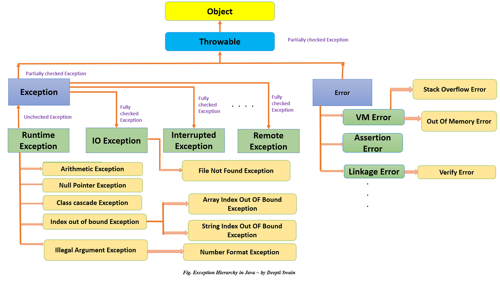
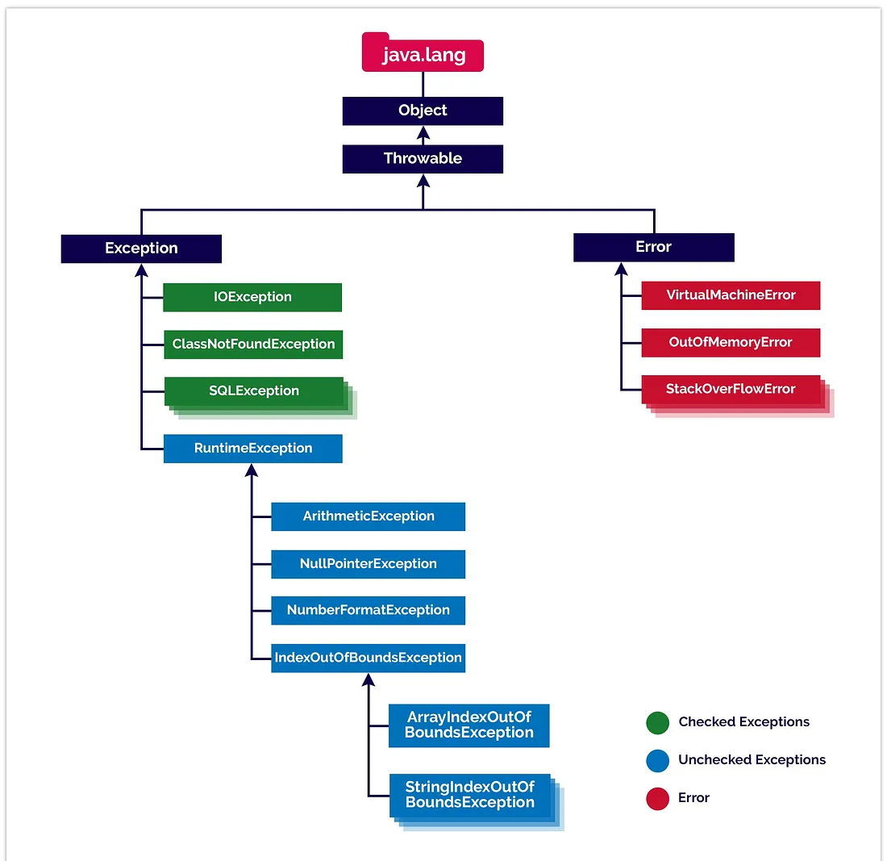

Exception Hierarchy in Java
===========================

Exception Notes

Exception Can be divided in 2 forms

**Checked** -   Checked exceptions are checked at compile time.
                Derived from Exception
                Checked exception must be handled using try-catch 
                    block or must be declared using throw keyword
                Can be recovered
**Examples** - IOException, SQLException, FileNotFoundException.

**Unchecked** - Unchecked exceptions are checked at run time.
                Derived from RuntimeException
                Cannot be recovered
**Examples** - NullPointerException, ArrayIndexOutOfBoundsException, NullPointer Exception

Creating Custom Exceptions
===========================
Checked Exception-
Create Custom exception class extending from Exception
------------------------------------------------------
    public class WrongFileNameException extends Exception {
    
    public WrongFileNameException(String errorMessage) {
    
    super(errorMessage);
    
    }
    
    }

_Main Class to use Custom Exception_
------------------------------------
        public class ExceptionMainClass {

        public static void main(String[] args)  {
        int i=10;

        try {
            if (i == 10) {
                throw new WrongFileNameException("sing");
            }
        }
        catch(WrongFileNameException d){
           System.out.println("Invaid value");
        }
    }
}

UnChecked Exception-

    class InsufficientInventoryException extends RuntimeException {
        public InsufficientInventoryException(String message) {
        super(message);
        }
    }

    class InventoryService {
        private int availableQuantity = 100; // Initial available quantity

        public void processOrder(int quantity) {
            if (quantity > availableQuantity) {
                // Throw a custom InsufficientInventoryException if the requested quantity exceeds available quantity
                throw new InsufficientInventoryException("Insufficient inventory. Available quantity: " + availableQuantity);
            }
            // Actual order processing logic goes here
            // Update inventory, process payment, etc.
        }
}

Main Class

        public class EcommerceApp {
            public static void main(String[] args) {
            InventoryService inventoryService = new InventoryService();
    
            try {
                // Attempt to process an order
                inventoryService.processOrder(150); // This should throw an InsufficientInventoryException
            } catch (InsufficientInventoryException e) {
                // Handle the InsufficientInventoryException
                System.out.println("Order processing failed: " + e.getMessage());
                // Additional error handling logic can be added here
            }
        }
}

**Which Custom Exception to use and when**
* If a client can reasonably be expected to recover from an exception, make it a checked exception. 
* If a client cannot do anything to recover from the exception, make it an unchecked exception
  
**Scenario**

For example, before we open a file, we can first validate the input file name. If the user input file name is invalid, we can throw a custom checked exception:

    if (!isCorrectFileName(fileName)) {
    throw new IncorrectFileNameException("Incorrect filename : " + fileName );
    }
    In this way, we can recover the system by accepting another user input file name.

    However, if the input file name is a null pointer or it is an empty string, it means that we have some errors in the code. In this case, we should throw an unchecked exception:
    
    if (fileName == null || fileName.isEmpty())  {
    throw new NullOrEmptyException("The filename is null or empty.");
    }

**Overriding and Overloading of exceptions**
--------------------------------------------
1. if any method in parent class is throwing any exception then in subclass overriding method cannot throw bigger exception, it can 
   throw either same exception as in parent method or should not throw any exception.
2. if any parent method is throwing any lower exception like NullPointerException then you can calling this method in child class in other method 
   then this method can throw higher exception.
    For example below-

public class ParentA {

    public void show() throws NullPointerException{

    System.out.println("PArent A show method");
   }

   }

public class ChildA extends ParentA{

    public void show() {
        System.out.println("Child A show method");
    }

    public static void main(String[] args) throws Exception {
        ParentA parentA=new ParentA();
        parentA.show();
    }
}

it runs fine.
3. Unreachable code will be a compile time error not run time error
4. Analyse the below program carefully

Class Test{

    void show(){
        try{
            A();
        }catch(RuntimeException e){
            System.out.println("Inside show method RuntimeException block");
        }
    }

    void A(){
        try{
            B();
        }catch(Exception e){
            throw new RuntimeException();
        }finally(){
            System.out.println("Inside A method finally block");
        }
    }

    void B(){
        throw new Exception();
    }

    public static void main(String[] args){
    show();
    }

}

when line no 167 will be executed call will not go to immediately to line no 159 instead first line no 169 will be invoked 
then line no 159 will be called

5. Base class cannot be thrown first before the derived or child class
    Below example

       class Base extends Exception {}
    
       class Derived extends Base  {}
    
        public class Main {
            public static void main(String args[]) {
            // some other stuff
            try {
            // Some monitored code
            throw new Derived();
            }
            catch(Base b)     {
            System.out.println("Caught base class exception");
            }
            catch(Derived d)  {
            System.out.println("Caught derived class exception");
            }
        }
    }

Compile time error

6. class Main {
   public static void main(String args[]) {
   try {
   throw 10;
   }
   catch(int e) {
   System.out.println("Got the  Exception " + e);
   }
   }
   }

compile time error as only throwable objects can be used inside catch params

