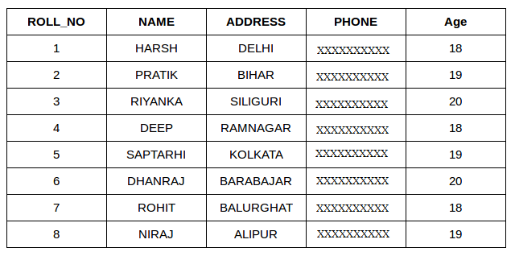
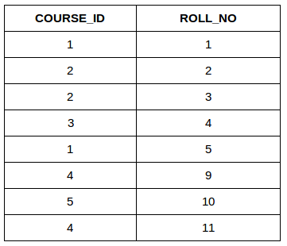

**What is JDBCTemplate**
--------------------------

JdbcTemplate is a class provided by the Spring JDBC module that simplifies database 
interaction by handling the complexities of JDBC (Java Database Connectivity),
such as resource management, connection handling, and exception translation.

jdbcTemplate.update(sql, id, name, dept); //for insert and update

jdbcTemplate.query(sql, new EmployeeRowMapper());//query

**Find average from one of the column in the table**
----------------------------------------------------

SELECT AVG(column_name)
FROM table_name;

**Find second highest in SQL**
-------------------------------

SELECT MAX(salary) AS second_highest_salary
FROM employees
WHERE salary < (SELECT MAX(salary) FROM employees);

**select top 3 records in java**
--------------------------------

SELECT * FROM Customers
LIMIT 3;

SELECT * FROM Customers
WHERE ROWNUM <= 3;

**Find the third highest in SQL**
---------------------------------

SELECT salary FROM employees ORDER BY salary DESC LIMIT 1 OFFSET 2;

This query orders the salary column in descending order, skips the first two highest values 
(using OFFSET 2),and retrieves the third highest.

**SQL Join types**
------------------

INNER JOIN: Returns rows that have matching values in both tables.
LEFT JOIN (LEFT OUTER JOIN): Returns all rows from the left table, and matching rows from the right table.
RIGHT JOIN (RIGHT OUTER JOIN): Returns all rows from the right table, and matching rows from the left table.
FULL JOIN (FULL OUTER JOIN): Returns all rows when there is a match in either table.
CROSS(Natural) JOIN: Produces the Cartesian product of two tables.

Examples:

Student Table

StudentCourse Table

**Difference Between  Natural Join and Inner Join**
---------------------------------------------------
While Natural Join and Inner Join are both used to combine data from two tables, they differ in the following ways:

In Natural Join you don't need to provide the matching column name e.g.

SELECT *
FROM employee
NATURAL JOIN department;

In Inner JOin you need to mention the matching column name

SELECT StudentCourse.COURSE_ID, Student.NAME, Student.AGE FROM Student
INNER JOIN StudentCourse
ON Student.ROLL_NO = StudentCourse.ROLL_NO;

**Indexing in DB**
------------------

Indexes allow queries to perform faster, especially on large datasets. However, while indexes speed up SELECT queries, they can slow down data manipulation operations (INSERT, UPDATE, DELETE)
It works by creating a separate data structure that provides pointers to the rows in a table, making it faster to look up rows based on specific column values.

Creating an Index
Creating an index allows us to define a quick access path to data. SQL indexes can be applied to one or more columns and can be either unique or non-unique. Unique indexes ensure that no duplicate values are entered in the indexed columns, while non-unique indexes simply speed up queries without enforcing uniqueness. You can create:

Single-column indexes: For basic queries
Multi-column indexes: For queries using multiple filters
Unique indexes: To ensure data uniqueness

**How do you count the number of records in a table without using COUNT(*)**
----------------------------------------------------------------------------
SELECT COUNT(id) FROM your_table;

**Difference between Count(*) and count() in oracle**
-----------------------------------------------------
Count * counts null also

**What is the difference between DELETE and TRUNCATE?**
-------------------------------------------------------
delete can delete the records using where clause where as truncate can delete all records at one go.

Truncate is faster than delete.

Drop remove the entire table irrespective it has records or not.

