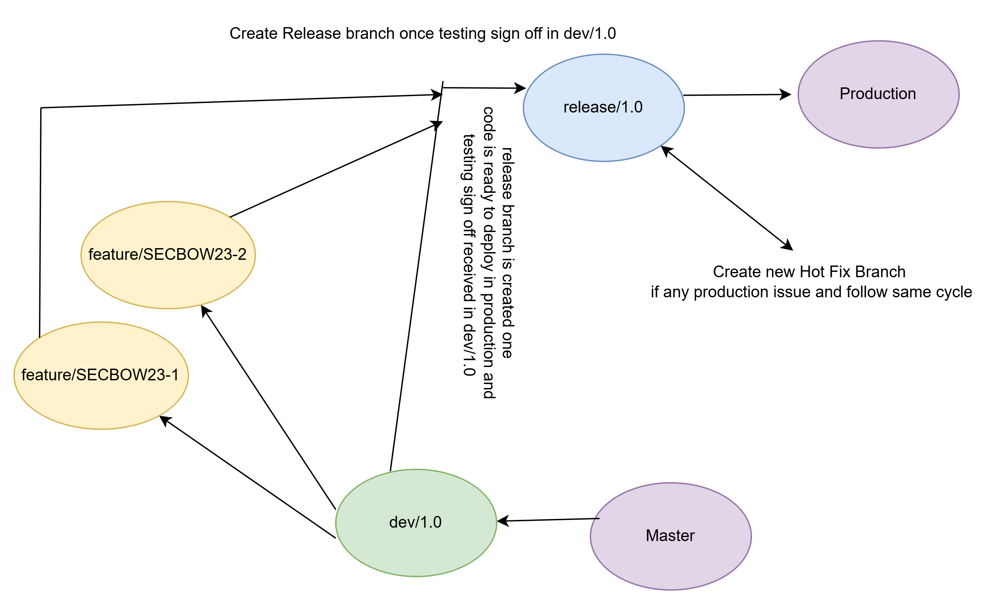

. Core Branches:
    main (or master): Represents the production-ready code.
    develop/1.0: The primary branch for ongoing development.
        **feature/SECBOW23-JIRA1**-Feature branch created for task.Once done the code is committed to this branch and PR raised to 
            merge in to develop/1.0.similar way we merge all feature branches to develop/1.0.

    release: Used to prepare code for deployment to a staging or testing environment, and can be merged into main when ready for production.
. Release Branches:
   Create a release branch from develop to prepare for a deployment.
   This branch is used for final bug fixes and testing before merging into main.
   After merging into main, tag the release and deploy to production. 
    if any defect in production then create branch from release as hotfix and merge the code in release and follow same cycle.

Please follow this image for branching strategy

