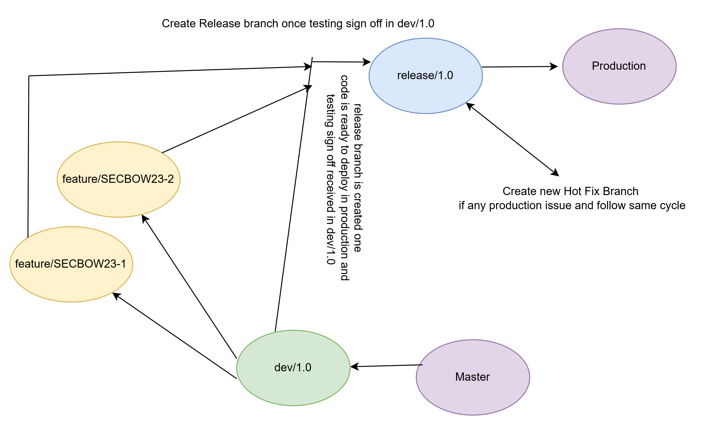

. Core Branches:
    main (or master): Represents the production-ready code.
    develop/1.0: The primary branch for ongoing development.
        **feature/SECBOW23-JIRA1**-Feature branch created for task.Once done the code is committed to this branch and PR raised to 
            merge in to develop/1.0.similar way we merge all feature branches to develop/1.0.

    release: Used to prepare code for deployment to a staging or testing environment, and can be merged into main when ready for production.
. Release Branches:
   Create a release branch from develop to prepare for a deployment.
   This branch is used for final bug fixes and testing before merging into main.
   After merging into main, tag the release and deploy to production. 
    if any defect in production then create branch from release as hotfix and merge the code in release and follow same cycle.

Please follow this image for branching strategy

==================================

we have 3 branching strategy
1. GitHub flow
2. Git Flow - Used in MAE Projects
3. Git Lab flow - Simpler than git flow and more structured than Git Hub flow

**What is gitlab work flow?**
-----------------------------
The GitLab workflow is a way of using Git and GitLab features (like Merge Requests, CI/CD, and Issues)
to collaborate on software development efficiently. 
It’s designed to be flexible, scalable, and suited to DevOps and CI/CD pipelines. Below are the steps
for Git lab flow
1. Clone the repository
2. Create Feature branch
3. Make your chnages locally
4. Push changes to Git lab
5. Create Merge Request - Link issues / add approvers and add labels
6. Code reviews done by TM/TL
7. GitLab CI/CD automatically runs tests, builds, and deploys based on your .gitlab-ci.yml
8. The MR cannot be merged until the pipeline passes (if set in rules)
9. Once approved and CI passes, the MR is merged into main or develop.

**What is Git Lab Migration**
-----------------------------

GitLab Migration is the process of moving projects, repositories, users, issues, merge requests, 
and CI/CD configurations from Bit Bucket/GitHub/stash

Benefits
1. You can use all in one place rather than using different -2 tools or links like
    jenkins,CI/CD and Jira.
2. Eliminates the need for juggling between tools like Jenkins, Jira, and GitHub.
3. Easily migrate from self-managed GitLab to GitLab SaaS (cloud-hosted), 
   reducing maintenance burden and scaling infrastructure effortlessly.
4. Consolidating tools reduces licensing, training, and integration costs — especially when migrating from a 
   fragmented toolchain to GitLab's all-in-one platform.

====================================================

**Git Lab Duo Work Flow  - How to fix Failing PL**
--------------------------------------------------
1. You must have Jenkins PL script available in Git Lab Project which you must have checked out in VSCode
2. Link your Git Lab Account in VS Code
3. select in VS Code from TOP  - Trouble shoot PL and provide PL code link to analyse what is the problem.

link for demo

https://www.youtube.com/watch?v=o2reCIF3Zb4

