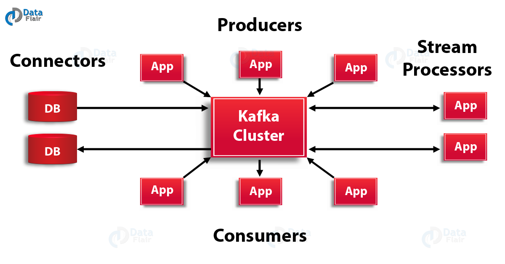
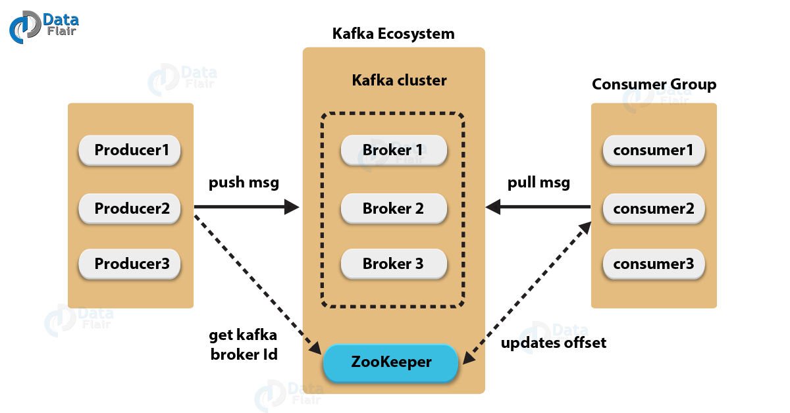
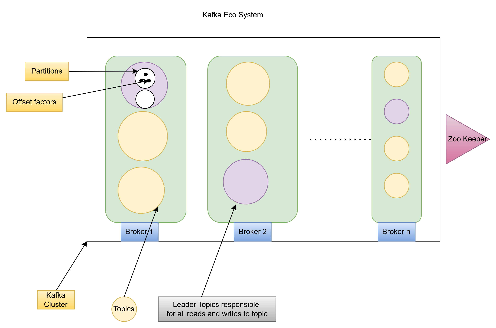

**Kafka Architecture**
----------------------

**Kafka Cluster Architecture**
------------------------------

**Kafka EcoSystem Diagram**
--------------------------

**Why Kafka?**
--------------

* Distributed, scalable, and fault-tolerant
* High throughput; capable of handling millions of messages per second.
* Retains messages for configurable durations, allowing reprocessing
* Publish / subscribe model with topics and partitions
* Supports multiple consumer groups, enabling load balancing
* Guarantees message order within partitions
* Replication across brokers for data durability
* Optimized for large-scale data streams

**Kafka vs SQS vs SNS**
------------------------

1. Kafka Topics - 
        There can be many topics,there is no limitation.
        we cannot change the data once it is published to topic.
        Topic can be divided in to multiple partitions.
        Each Partition is replicated to all brokers.

3. Kafka Brokers - Manages the storage of messages in the topic.
4. Kafka ZooKeeper - Its a kind of keeper
2. 
