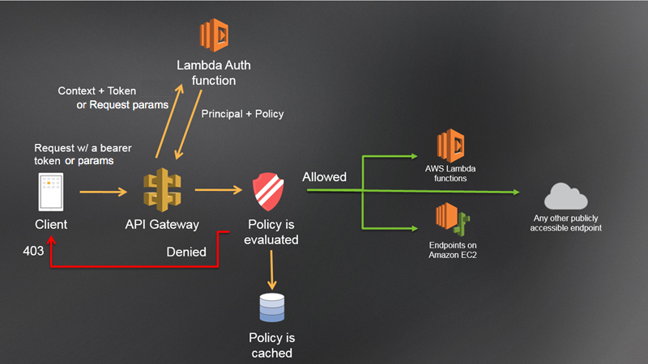

**How the build PL , Deploy PL , Infra PL works in MAE**
--------------------------------------------------------

Infra PL - Runs only one time in each environment and creates the infrastructure

Build PL - bundles the AIP Code from specific branch and version and upload the jar in nexus.

Deploy PL- uploads the jar from nexus to s3 bucket and then upload same jar from S3 bucket to relevant lambda(created by infra PL
)

**How OAS are deployed, which PL is used and how API Gateways are created/configured with each lambda.**
--------------------------------------------------------------------------------------------------------
API Gateway are the rules set or router which is configured in openapi.yaml file
OAS file is deployed in API Gateway with all rule sets via Deploy PL

Format of OAS file

paths:
    /aips:
       summary:
       description:
       put:
        tags:
            -aipdetails
        security:
        parameter:
            - name: ChannelContext
              in: header/path
              required: true
              example: "intermediary"
              schema:
                $ref: "#/components/schemas/schemaChannelContext"
        requestBody:
            content:
                application/json:
                    examples:
                        requestExample: "components/examples/requestbodyexample"
                    schemas:        
        response:
        x-amazon-apigateway-request-validator: validates the body , header and query parameters
        x-amazon-apigateway-integration: //this property integrates the built API Gateway with respective lambdas
            credentials: {aipDetailsLambdaRoleARN}// in this you need to give rolearn which allows apis to access resources
                                                    like wise we have given DYNAMODB access, S3 Full access, SQS Full access
                                                    SQS Full Access, XRay full access, Secret Manager read write full access, Cloud watch full access.
                                                    this property is defined in config repo under openapi.properties file
            uri: {aipDetailsLambdaUri}//this property is defined in config repo under openapi.properties file
            httpmethod: POST

components:
    schemas:
        schemaChannelContext:
            description:
            deprecated:
            nullable:true
            required:
                - attributea
                - attributeb
            properties:
                attributea:
                    maxlength:2
                    minlength:3
                    pattern:
                    type: string
    examples:
        requestbodyexample:
            value:
                data:
                    - array
                      one
                      two
    headers:
    securitySchemes:
        aip-authorizer-lambda:
            description:
            type:
            name:
            in: header
            x-amazon-apigateway-authtype: custom
            x-amazon-apigateway-authorizer /// this will integrate the authorisor with API Gateway so when any request will come to gateway it will call lambda authrisor 
                                            for authorisation and authentication
                authorizeURL: {aipAuthorizerLambdaURI}
                authorizerCredentials: {aipAuthorizerLambdaRoleARN}
                type: request/token/jwt //request: If Gateway will recieve callers identity in header,
                                        request param,
                                        token: If Gateway will recieve callers identity in bearer token

**Code Base structure for MAE**
-------------------------------
    Infra-

agreement-in-principle-infra
    aip-details-lambda.properties
    aip-authorisor-lambda.properties
    aip-gateway.properties

Each File contains the 
apiname
apigatewayvpcendpoint
cellname
featurename

    Config
aip-details-lambda
    envioronment.properties - ALL DB , exception handling messages,logging levels, max retry ,bag enabled 
    aip-details-lambda.properties

**How Lambda Authoriser works in AWS**
--------------------------------------
AWS Lambda Authorisor can be invoked by API Gateway for accessing the APIs
Lambda Authorisor is used to validate client based on the callers identity and returns an IAM Policy.
In MAE lambda authorisor is used as oAUth authentication strategy as Bearer token is passed in headers.

**AWS Lambda Authorizer work flow architecture diagram**
--------------------------------------------------------

Consider this diagram to understand the flow

API Gateway Lambda authorization workflow
1. The client calls a method on an API Gateway API, passing a bearer token and caller identity.

2. API Gateway checks if the method request is configured with a Lambda authorizer. 
   If it is, API Gateway calls the Lambda function.

3. The Lambda function authenticates the caller. The function can authenticate in the following ways:

    By calling out to an OAuth provider to get an OAuth access token.
    
    By calling out to a SAML provider to get a SAML assertion.
    
    By generating an IAM policy based on the request parameter values.
    
    By retrieving credentials from a database.

4. The Lambda function returns an IAM policy and a principal identifier. If the Lambda function does not return that information, the call fails.

5. API Gateway evaluates the IAM policy.

    If access is denied, API Gateway returns a suitable HTTP status code, such as 403 ACCESS_DENIED.
    
    If access is allowed, API Gateway invokes the method.
    
    If you enable authorization caching, API Gateway caches the policy so that the Lambda authorizer function isn't invoked again.

You can customize the 403 ACCESS_DENIED or the 401 UNAUTHORIZED gateway responses.

**MAE Dynamo DB Operations**
----------------------------

we use aws sdk library for dynamodb operations transactwriteitems and TransactReadItems

