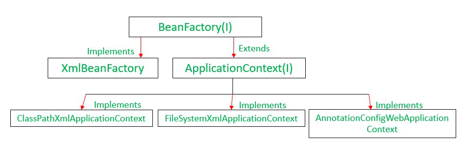
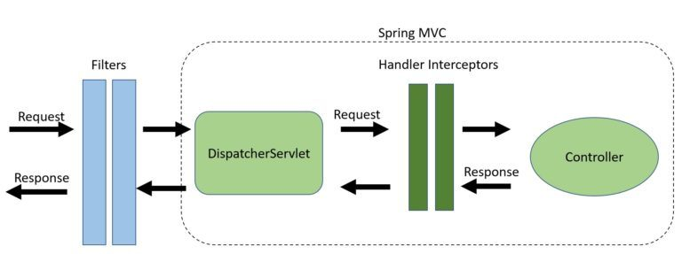

Async in Spring Boot
---------------------
In spring boot same can be achieved by using
@Async annotation

**What Spring Boot Starters Are Available Out There?**
------------------------------------------------------
At the time of this writing, there are more than 50 starters at our disposal. 
Here, we’ll list the most common:

spring-boot-starter: core starter, including auto-configuration support, logging and YAML
spring-boot-starter-aop: for aspect-oriented programming with Spring AOP and AspectJ
spring-boot-starter-data-jpa: for using Spring Data JPA with Hibernate
spring-boot-starter-security: for using Spring Security
spring-boot-starter-test: for testing Spring Boot applications
spring-boot-starter-web: for building web, including RESTful, applications using Spring MVC
spring-boot-starter-parent - The spring-boot-starter-parent project is a special 
    starter project that provides default configurations for our application and a 
    complete dependency tree to quickly build our Spring Boot project. 
    It also provides default configurations for Maven plugins,

**Common Annotations in Spring Boot**
--------------------------------------

**@SpringBootApplication** - The @SpringBootApplication annotation is equivalent to using 
                             @Configuration, @EnableAutoConfiguration, and @ComponentScan
                             Spring Boot enables the developer to use a single annotation 
                             instead of using multiple. 

**@ComponentScan**
        Spring Boot application scans all the beans and package declarations when the application 
        initializes. 
        You need to add the annotation for your class file to scan your components added to your project.

**@Component**
        To mark any bean as spring managed bean

**What is the difference between @RestController and @Controller in Spring Boot?**

* @Controller is used to mark classes as Spring MVC Controller where as @RestController annotation is 
    a special controller used in RESTful Web services, and it’s the combination of @Controller and 
    @ResponseBody annotation.

* In @Controller, we need to use @ResponseBody on every handler method and In @RestController, 
  we don’t need to use @ResponseBody on every handler method.
  In MAE we have used @RestController and have also given @GetMapping , @ResponseStatus

**What is an IOC container?**

Spring IoC Container is the core of Spring Framework. It creates the objects, configures and assembles 
their dependencies, manages their entire life cycle. The Container uses Dependency Injection(DI) to 
manage the components that make up the application. It gets the information about the objects from 
a configuration file(XML) or Java Code or Java Annotations and Java POJO class. These objects are 
called Beans. Since the Controlling of Java objects and their lifecycle is not done by the developers, 
hence the name Inversion Of Control.

**what is dependency injection in spring**
------------------------------------------
Dependency Injection is a design pattern that allows the spring container to ‘inject’ objects into 
other objects or dependencies

**Features of spring boot framework**

IoC container
Data Access Framework
Spring MVC
Transaction Management
Spring Web Services
JDBC abstraction layer
Spring TestContext framework

**Containers in Spring**

    BeanFactory Container

BeanFactory represents a basic IoC container which is a parent interface of ApplicationContext. 
BeanFactory uses Beans and their dependencies metadata to create and configure them at run-time. 
BeanFactory loads the bean definitions and dependency amongst the beans based on a configuration 
file (XML) or the beans can be directly returned when required using Java Configuration.

    Sample code for using Bean-Factory

    @SpringBootApplication
    // Main class
    public class DemoApplication
    {
    // Main driver method
    public static void main(String[] args)
    {
    // Creating object in a spring container (Beans)
    BeanFactory factory = new ClassPathXmlApplicationContext("bean-factory-demo.xml");
    Student student = (Student) factory.getBean("student");
    
        System.out.println(student);
    }
    }

    ApplicationContext Container

This interface is designed on top of the BeanFactory interface. 
The ApplicationContext interface is the advanced container that enhances BeanFactory 
functionality in a more framework-oriented style. 
While the BeanFactory provides basic functionality for managing and manipulating beans, 
often in a programmatic way, the ApplicationContext provides extra functionality like MessageSource, 
Access to resources, Event propagation to beans, Loading of multiple (hierarchical) contexts etc. 
There are so many implementation classes that can be used such as ClassPathXmlApplicationContext, 
FileSystemXmlApplicationContext, AnnotationConfigWebApplicationContext etc.

**BeanFactory and Application Context Hierarchy**

**Difference between Bean Factory and Application Context**
    
**BeanFactory -** 
    Fundamental container providing basic functionality for managing beans.
    Suitable for building standalone applications.
    Supports only Singleton and Prototype bean scopes.
    Does not support annotations; requires configuration in XML files.
    Does not provide internationalization (i18n) functionality.

**ApplicationContext**
    Advanced container extending BeanFactory with additional features.
    Suitable for building web applications, integrating with AOP modules, ORM, and distributed applications.
    Supports all types of bean scopes, including Singleton, Prototype, Request, Session, etc.
    Supports annotation-based configuration for bean autowiring.
    Extends MessageSource interface to provide internationalization (i18n) functionality.

**What is the difference between RequestMapping and GetMapping?**

RequestMapping can be used with GET, POST, PUT, and many other request methods using the method 
attribute on the annotation. Whereas getMapping is only an extension of RequestMapping 
which helps you to get the value from DB/Service.

**What is dependency Injection?**
* Setter Injection: The IOC container will inject the dependent bean object into the target bean object by calling the setter method.
* Constructor Injection: The IOC container will inject the dependent bean object into the target bean object by calling the target bean constructor.
* Field Injection: The IOC container will inject the dependent bean object into the target bean object by Reflection API.
  Dependency injection promotes loose coupling and easier testing.

Constructor dependency is preferred and recommended because it explicitly states all required dependencies
at object creation, making code more readable, maintainable, and testable, while also enforcing that all 
necessary dependencies are provided, preventing potential runtime errors due to missing dependencies

**Key benefits of constructor injection:**

Clear Dependencies
Immutability
Compile-time safety
Improved Testability
Reduced Circular Dependencies

**What are the types of dependency injections in spring boot available**
Setter Injection - No Scope for circular dependency
Example -

    public class GFG {
    
        // The object of the interface IGeek
        private IGeek geek;
    
        // Setter method for property geek with @Autowired annotation
        @Autowired
        public void setGeek(IGeek geek) {
            this.geek = geek;
        }
    }
Constructor Injection - Scope for circular dependency

Example

    public class GFG {
    
        // The object of the interface IGeek
        private IGeek geek;
    
        // Constructor to set the CDI
        public GFG(IGeek geek) {
            this.geek = geek;
        }
    }

Field Injection - Just autowired annotation before the field

        @RestController
        public class TestController {
        @Autowired
        private  TestRepository testRepository;
        }
        
        @Repository
        class TestRepository{
        
        }

****which injection is good to use and why****

    Constructor-based or setter-based DI?
    Since you can mix constructor-based and setter-based DI, it is a good rule of thumb to use constructors
    for mandatory dependencies and setter methods or configuration methods for optional dependencies. 
    Note that use of the @Autowired annotation on a setter method can be used to make the property be a 
    required dependency; however, constructor injection with programmatic validation of arguments is 
    preferable

**How is spring framework different to spring boot**

    Spring boot has got extra support for configuration and embedded servers like tomcat, jetty etc.

**what is @EnableAutoConfiguration**

    @EnableAutoConfiguration is a core Spring Boot annotation that simplifies the setup of Spring 
    applications by automatically configuring beans based on the dependencies present in the classpath. 
    This annotation eliminates the need for manual configuration of commonly used components like databases,
    web servers, and security.

    you can use @componentscan and @EnableAutoConfiguration together to manage dependencies.

    Spring Currently supports @SpringBootApplication which includes all below
    @ComponentScan
    @EnableAutoConfiguration 
    @SpringBootConfiguration
    @Configuration

**Disable Auto Configuration in spring boot**

    @EnableAutoConfiguration(exclude={className})

**Spring bean scopes**
    The Types of Bean Scopes in Spring Boot
    Spring Boot supports five primary bean scopes:
    
    Singleton - Default scope in Spring.only one instance of that bean is created in the Spring container. 
                This instance is shared across the entire application.
           Use Case - Singleton beans are suitable for stateless objects, shared resources, and scenarios 
                where only one instance is needed throughout the application. Examples include database 
                connection pools, service classes, and DAO classes.    
    Prototype - Creates a new instance of the bean every time it’s requested from the Spring container. 
                To define a bean as prototype, use @Scope("prototype").
                Use Case - Prototype scope is ideal for stateful beans or instances that hold temporary data and 
                are expected to change frequently. Examples include non-thread-safe classes or 
                any component that requires new data on every use.
    Request - The request scope is specific to web applications. A new instance of a bean is created for each HTTP request, 
                and it’s discarded once the request is complete. To use request scope, annotate with @Scope("request").
        Use Case - Request scope is ideal for request-specific data, such as session tokens, 
                    or components that need to carry temporary data within a single HTTP request.
    Session - The session scope creates a new bean instance for each user session in a web application. 
                The bean is available for the duration of the session. To define a bean with session 
                scope, use @Scope("session").
        Use Case - Session scope is ideal for session-specific data, like user information, preferences, or 
                    any data that needs to persist throughout the session.
    Application - The Spring container creates a new instance of the AppPreferences bean by using the appPreferences bean definition once for the entire web application.
                  This is somewhat similar to a Spring singleton bean but differs in two important ways:
                    It is a singleton per ServletContext, not per Spring ApplicationContext
**@Autowired**
----------------

**How Validation is happening in Spring**
-----------------------------------------

    Use jakarta Validation and below are the annotations which can be used-
        @NotBlank
        @Pattern
        @Valid
        @Min
        @Max
        @DecimalMax
        @DecimalMin
    
    
    Use Jackson jar for Models annotations
        @JsonProperty

**How does Spring Boot handles external configuration**
--------------------------------------------------------
you can place application.properties file or application.yml file in resources folder and provide 
references like below

    @Configuration
    @ConfigurationProperties(prefix = "mail")
    public class ConfigProperties {
    
        private String hostName;
        private int port;
        private String from;
    
        // standard getters and setters
    }
@Configuration is used to initialize the spring bean in application context
@ConfigurationProperties is used to use the hierarchy mentioned in the prefix mail

If we don’t use @Configuration in the POJO, then we need to add @EnableConfigurationProperties(ConfigProperties.class) in the main Spring application class to bind the properties into the POJO:

    @SpringBootApplication
    @EnableConfigurationProperties(ConfigProperties.class)
    public class EnableConfigurationDemoApplication {
    public static void main(String[] args) {
    SpringApplication.run(EnableConfigurationDemoApplication.class, args);
    }
    }

**Common Errors in Spring Boot**
--------------------------------

1. nosuchbeandefinitionexception

Consider below example 1

    @Component
    public class BeanA {
    
        @Autowired
        private BeanB dependency;
        //...
    }

    package com.baeldung.packageB;
    @Component
    public class BeanB { ...}

    In this case BeanB is defined in package packageB but this package is not scanned as we use 
    @ComponentScan("com.baeldung.packageA") then this error will come

Consider below example 2

    @Component
    public class BeanB1 implements IBeanB {
    //
    }

    @Component
    public class BeanB2 implements IBeanB {
    //
    }

    @Component
    public class BeanA {
    
        @Autowired
        private IBeanB dependency;
        ...
    }

here also you will get exception
    Caused by: org.springframework.beans.factory.NoUniqueBeanDefinitionException:
    No qualifying bean of type
    [com.baeldung.packageB.IBeanB] is defined:
    expected single matching bean but found 2: beanB1,

Solution for this would be 

    @Component
    public class BeanA {
    
        @Autowired
        @Qualifier("beanB2")
        private IBeanB dependency;
        ...
    }

**Circular Dependency in Spring**
----------------------------------
    Bean A → Bean B → Bean A

    Here as you can see, there is a circular dependency and Spring won’t be able to decide which of the 
    beans should be created first, since they depend on one another. When Spring encountered this type 
    of issue, it raise an exception BeanCurrentlyInCreationException while loading context.

Note - We have to remember this one thing that spring context throw BeanCurrentlyInCreationException 
while loading context when we use constructor-based dependency injection. If we use any other 
dependency injection method then spring will not throw this exception in case of circular dependency.

Consider an example below

    @Component
    public class BeanA {
    
        private BeanB beanB; 
      
        @Autowired
        public BeanA(BeanB beanB) { 
            this.beanB = beanB; 
        } 
    }

    @Component
    public class BeanB {
    
        private BeanA beanA; 
      
        @Autowired
        public BeanB(BeanA beanA) { 
            this.beanA = beanA; 
        } 
    }
Solution 1
    Use @Lazy: We are assuming that you know about @Lazy annotation and how it works. 
    So with the help of @Lazy annotation, we can solve the issue. We can tell Spring to initialize 
    one of the beans lazily. The injected bean will only be fully created when it’s first needed and at \
    the time of bean creation, it injects the proxy bean as a dependency.

    @Component
    public class BeanA {
    
        private BeanB beanB; 
      
        @Autowired
        public BeanA(@Lazy BeanB beanB) { 
            this.beanB = beanB; 
        } 
    }

Solution 2

    In the case of setter-based dependency injection, Spring creates a bean by calling the constructor 
    first and then injecting the dependencies with the help of setter methods. 
    So here Spring won’t raise BeanCurrentlyInCreationException as Spring will have the required object 
    at the time of dependency injection. 

**Difference between Spring Boot and Spring Framework**

    Spring is a comprehensive framework providing a wide range of features, while Spring Boot is an 
    extension of Spring that focuses on simplifying application setup by offering auto-configuration 
    and convention-over-configuration, making it easier to quickly build and deploy standalone applications
    with minimal boilerplate code; essentially, Spring Boot aims to streamline the development process 
    based on Spring's core functionalities.

**Lazy Initialization in Spring Bean**

    Spring initializes all singleton beans eagerly at the application startup
    To lazy start any spring bean use @Lazy annotation.

**SPRING MCQs**

https://www.geeksforgeeks.org/quizzes/java-spring-mcq-quiz/

https://www.tutorialspoint.com/spring/spring_online_quiz.htm

**@Bean Annotations**
---------------------
you should use @Bean Annotation in below conditions

    Third-party classes: If you want to instantiate a class from a third-party library, you may not be able 
    to annotate the class directly with Spring’s @Component (or its specializations @Service, @Repository, 
    @Controller). In this case, you can use a @Bean method in a @Configuration class.

    Conditional bean creation: You may want to create a bean conditionally — only under certain 
    circumstances. This is easily done with a @Bean method.

**@Autowiring in spring boot**
------------------------------

Autowiring in the Spring framework can inject dependencies automatically. The Spring container 
detects those dependencies specified in the configuration file and the relationship between the beans. 
This is referred to as Autowiring in Spring.

**Modes of autowiring in Spring Boot**

No
byName
byType
Constructor
Autodetect - The autodetect mode uses two other modes for autowiring – constructor and byType.

**Spring Batch**
-----------------
Components-

ItemReader: Reads data from a source (e.g., a file or database).
ItemProcessor: Processes the data (e.g., transforms or filters).
ItemWriter: Writes the processed data to a destination.

**Simple spring batch program**
-------------------------------
Annotation used in Spring Batch Program

1. Create simple batch config file
-----------------------------------

       @Configuration
       @EnableBatchProcessing
       public class BatchConfig {
       @Bean
       public Job job(JobBuilderFactory jobBuilderFactory,
       StepBuilderFactory stepBuilderFactory) {
                return jobBuilderFactory.get("job")
                    .start(step(stepBuilderFactory))
                    .build();
       }
    
    
        @Bean
        public Step step(StepBuilderFactory stepBuilderFactory) {
            return stepBuilderFactory.get("step")
                    .<String, String>chunk(10)
                    .reader(reader())
                    .processor(processor())
                    .writer(writer())
                    .build();
        }
    
    
        @Bean
        public ItemReader<String> reader() {
            return new SimpleItemReader();
        }
    
    
        @Bean
        public ItemProcessor<String, String> processor() {
            return new SimpleItemProcessor();
        }
    
    
        @Bean
        public ItemWriter<String> writer() {
            return new SimpleItemWriter();
        }
    }

2. Create SimpleItemReader
------------------------------

    public class SimpleItemReader implements ItemReader<String> {
    private String[] data = {"Alice", "Bob", "Charlie", "Diana"};
    private int index = 0;
        @Override
        public String read() {
            if (index < data.length) {
                return data[index++];
            }
            return null; // End of data
        }
    }

3. Create ItemProcessor
-----------------------
    public class SimpleItemProcessor implements ItemProcessor<String, String> {
    @Override
        public String process(String item) {
            return item.toUpperCase(); // Convert item to uppercase
        }
    }

4. Create Itemwriter
---------------------
       public class SimpleItemWriter implements ItemWriter<String> {
       @Override
           public void write(List<? extends String> items) {
                items.forEach(System.out::println); // Print items to console
           }
       }

5. Create spring batch run application
--------------------------------------
    @SpringBootApplication
    public class BatchApplication {
        public static void main(String[] args) {
            SpringApplication.run(BatchApplication.class, args);
        }
    }

**Spring Boot Performance Optimization**
-----------------------------------------
1. Remove Inefficient code
   Inefficient Code and Algorithms with worst time complexity O(n)
2. Use asynchronous calls where ever it is necessary instead of synchronous calls as synchronous calls made performance impact 
3. Slow Database Queries
4. Use profiling tools to monitor if any threads are still active and of no usage. Those threads can be killed immediately.

**Spring Boot Filters and Interceptors**
----------------------------------------

    **Exact Use Case Where Filters Can Be Used, but Interceptors Cannot**
    ---------------------------------------------------------------------

    1. Authentication Before DispatcherServlet → When you need to authenticate requests globally, 
        before they reach controllers.
    2. Logging of Raw HTTP Requests/Responses → If you want to log the request body, method, 
        or headers before Spring MVC processes it.
    3. Compression (Gzip, Brotli) → To compress/decompress data at the Servlet layer.

    **Exact Use Case Where Interceptors Can Be Used, but Filters Cannot**
    ---------------------------------------------------------------------
    1. Handling Authorization Based on Business Logic (e.g., checking user roles at a controller level).

**CORS(cross origin request) in Spring**
----------------------------------------
CORS is a technique which determines if request is originated from genuine page or any malicious page 
and restrict access to resources or backend APIs.
This is needed usually in web application to secure access to APIs.

    **Following is the sample program to allow only mentioned in the @CrossOrigin(origins = "http://example.com")**
    ----------------------------------------------------------------------------------------------------------------

    import org.springframework.web.bind.annotation.CrossOrigin;
    import org.springframework.web.bind.annotation.GetMapping;
    import org.springframework.web.bind.annotation.RestController;
    
    @RestController
    public class ProductController {
    
        @CrossOrigin(origins = "http://example.com")
        @GetMapping("/products")
        public List<String> getProducts() {
            return List.of("Laptop", "Smartphone", "Tablet");
        }
    }

**Types of CORS**
------------------

1. specific domains
   @CrossOrigin(origins = "http://example.com")
2. specific method allowed from origin
   @CrossOrigin(origins = "http://example.com", methods = {RequestMethod.GET, RequestMethod.POST})
3. specific headers in the domain request
   @CrossOrigin(origins = "http://example.com", allowedHeaders = {"Content-Type", "Authorization"})

**How to determine from which domain the request is coming in spring**
----------------------------------------------------------------------
In filter class

String origin = request.getHeader("Origin"); // Indicates the domain making the request (used in CORS requests).
String referer = request.getHeader("Referer"); //Indicates the previous page the request was made from.
String host = request.getHeader("Host"); 

CORS should be configured in servlet filters than interceptors.

**Spring JPA**
--------------

Hibernate is one example of ORM. In short, JPA is the interface while hibernate is the 
implementation. 

Spring Data JPA is not a JPA provider, it is a library/framework that adds an extra layer of 
abstraction on the top of our JPA provider line Hibernate.

**Common Annotation used in Spring JPA**
------------------------------------------
@Entity
@Id
@GeneratedValue -strategy = GenerationType.AUTO
@Repository

    Example -   @Repository
                public interface EmployeeRepository extends JpaRepository<Employee, Long>{
                ArrayList<Employee> findAllEmployee();
                }

Below service class uses how to interact with Database

    @Service
    public class EmpServiceImpl implements EmpService {
    @Autowired
    EmployeeRepository employeeRepository;
    
    @Override
    public ArrayList<Employee> findAllEmployee() {
        return (ArrayList<Employee>) employeeRepository.findAll();
    }
  
    @Override
    public Employee findAllEmployeeByID(long id) {
        Optional<Employee> opt = employeeRepository.findById(id);
        if (opt.isPresent())
            return opt.get();
        else
            return null;
    }

Using EntityManager

EntityManager are useful when looking to create/run custom queries.

Create Entity class

        @Entity
        public class User {
        @Id
        @GeneratedValue
        private Long id;
        private String name;
        private String email;
        // ...
        }

We don’t have direct access to the EntityManager in a JpaRepository, and therefore we need to create our own.

    @PersistenceContext
        private EntityManager entityManager;
    
    @Override
    public User customFindMethod(Long id) {
        return (User) entityManager.createQuery("FROM User u WHERE u.id = :id")
        .setParameter("id", id)
        .getSingleResult();
    }

**Using entity manager to run the queries**
-------------------------------------------

EM should be used to run any native queries
e.g.

Query query = em.createNativeQuery("SELECT * FROM users WHERE age > ?", User.class);

query.setParameter(1, 30);

List<User> users = query.getResultList();

**Difference between EM(jpa) persist and spring data save**
-----------------------------------------------------------

EM persist is used to create new entity.This is governed by JPA Library

save is used for creating or updating the record and its governed by spring data JPA

**Lock Mechanism in Spring**
-----------------------------

Lock mechanism ensures the data consistency and manage concurrency in multithreaded and distributed
environment.

Spring provides 2 methods for Locking Mechanism

**Pessimistic Locking**
-----------------------

1. lock is obtained on the resource ensuring no other process can access it.

2. Once locked is released then only resource can be accessed by other process.

1. Pessimistic Example

    @Transactional
    public void updateProduct(Long productId) {
    Product product = entityManager
    .createQuery("SELECT p FROM Product p WHERE p.id = :id", Product.class)
    .setParameter("id", productId)
    .setLockMode(LockModeType.PESSIMISTIC_WRITE)
    .getSingleResult();
    
        product.setPrice(product.getPrice().add(BigDecimal.TEN));
    }

2. Optimistic Locking
This can be achieved by adding one version in each attribute

@Version

Example:

        @Entity
        public class Student {
    
        @Id
        private Long id;
    
        private String name;
    
        private String lastName;
    
        @Version
        private Integer version;

}

While using it, each transaction that reads data holds the value of the version property.

Before the transaction wants to make an update, it checks the version property again.

If the value has changed in the meantime, an OptimisticLockException is thrown. Otherwise, the transaction commits the update and increments a value version property.

